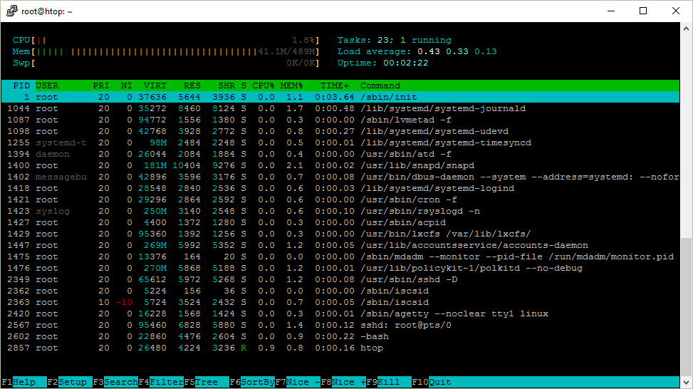
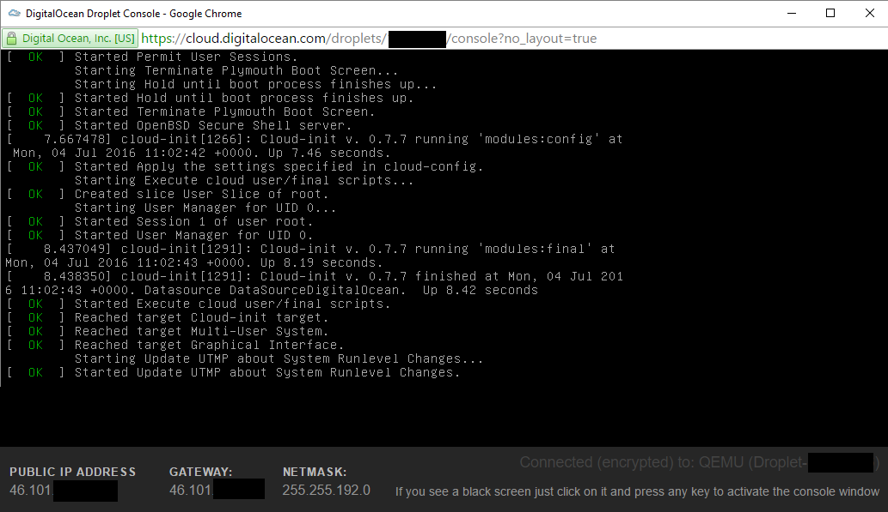
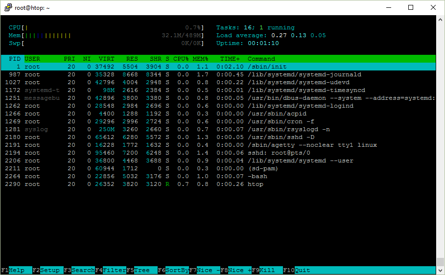
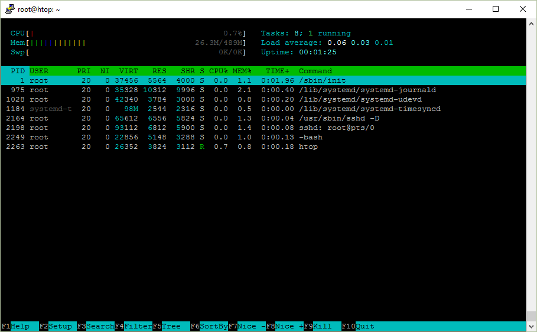
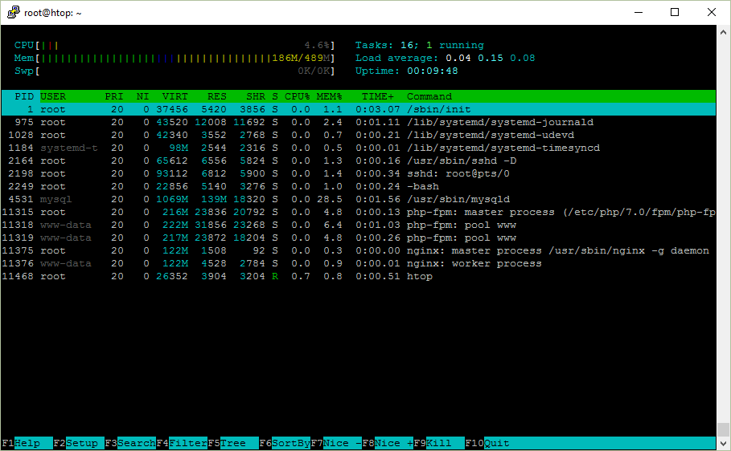
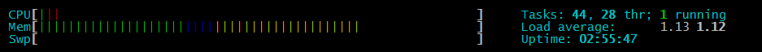
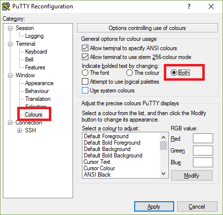
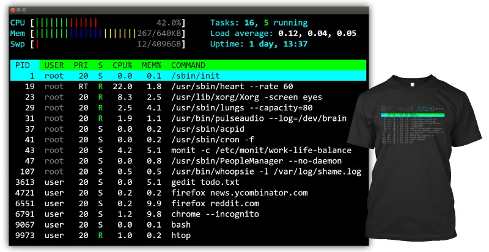

# htop の動きを明確にする
長い間、私は htop の全ての意味を理解していませんでした。

例えば私が所有する2コア搭載のPCで表示されていた "``load average 1.0``" は「CPU 使用率は 50% です」という意味だと思っていました。 これは全く正しくありません。 また、なぜ ``1.0`` なのでしょう？

そこで私は htop の表示について全てを調べて文書化することにしました。 何かを学ぶ最良の方法はそれを教えることだとも言いますし。

---
## Ubuntu Server 16.04 (x64版) の場合
これが、これから調べようとする htop のスクリーンショットです：



## 稼働時間 （Uptime）
Uptime は「どれぐらいシステムが稼働しているか」を表しています。 ``uptime`` コマンドを実行すると同じ情報を得ることができます：

```shell
 $ uptime
 11:14:34 up 123 days, 19:50, 16 users,  load average: 0.19, 0.08, 0.01
```

``uptime`` コマンドはどうやってこの情報を取得するのかわかりますか？ 実は ``/proc/uptime`` ファイルから情報を読み取っているのです：

 ```shell
 $ cat /proc/uptime
 6366290.61 21767700.08
 ```
   * 最初の数値はシステムが起動してからの稼働時間（秒）
   * 二番目の数値はシステムがどれくらいの時間（秒）アイドル状態であったかを示し、通常は複数のCPUコアの分だけ合算されるため（最初の引数である）システムの稼働時間よりも大きな値になる

どうやってそれが分かったのかって？ それは ``uptime`` コマンドが実行中に何のファイルをオープンしたのかを調べたからです。 これは ``strace`` コマンドを使って調べることができます:
```shell
  $ strace uptime
```
これを実行するとたくさん出力されるでしょう。そこで ``grep`` コマンドで ``open`` システムコールを探します。但し、そんなに簡単ではないです。なぜなら ``strace`` コマンドの出力は全て標準エラー出力（ _stderr_ ）に送られるからです。そこで ``2>&1`` という「お呪い」を使って標準エラー出力から標準出力（ _stdout_ ）にデータをリダイレクトしてみます。これが、その結果の一部です：
```shell
  $ strace uptime 2>&1 | grep open
  ...
  open("/proc/uptime", O_RDONLY)          = 3
  open("/var/run/utmp", O_RDONLY|O_CLOEXEC) = 4
  open("/proc/loadavg", O_RDONLY)         = 4
```
この中には、前述した ``/proc/uptime`` ファイルが含まれているのがわかります.
あるいは ``strace -e open uptime`` を実行することでも同じ結果を得られます。その上 grep コマンドの使い方に頭を悩ますこともありません。

さて、なぜファイルを読むよりも ``uptime`` コマンドの方が必要なのでしょうか？ このコマンドの出力は人間にとって読みやすい形式になっている上に、「秒数」はスクリプトや他のプログラムで使用するのにとても便利だからです。

## ロードアベレージ (Load Average)
あと Uptime に加えて「ロードアベレージ（ _load average_ )」を表す数字が3個並んでいます：
```shell
 $ uptime
 11:14:34 up 123 days, 19:50, 16 users,  load average: 0.19, 0.08, 0.01
```
これらは ``/proc/loadavg`` ファイルからもらった情報です。もう一度 ``strace`` の出力結果を見てみると、このファイルが同じようにオープンされているのがわかるでしょう。

```shell
 $ cat /proc/loadavg
 0.00 0.01 0.03 1/120 1500
```
先頭から3つの数値は1分前、5分前、15分前のシステムの負荷の平均値を示しています。4番目は現在、実行中（``RUNNING``状態）のプロセス数と実行可能なプロセスの総数を表しています。最後の数値は使用中の PID のうち最新のものを表しています。

---
それでは、この最後の数値（最新のPID）について。OS は新しいプロセスを起動する度に任意の ID 番号を付与します。このプロセス ID は常に増えていくが上限まで使い切ると再利用することになる。プロセス ID = 1 は ``/sbin/init`` というシステム起動時に呼びされるプロセスに割当てられる固定の ID である。

それでは、もう一度 ``/proc/loadavg`` の中身を見てから ``sleep`` コマンドをバックグランドで起動してみましょう。プロセスをバックグラウンドで起動するとプロセス ID が表示されます：

```shell
 $ cat /proc/loadavg
 0.00 0.01 0.03 1/123 1566
 $ sleep 30 &
 [1] 20599
```
ここで ``1/123`` は、この時点で実行中または実行の準備ができているプロセスが``1`` 個あり、プロセスの総数は ```123``` 個であることを示しています。
``htop`` コマンドを起動して実行中のプロセスを見てみると、それは ``htop`` プロセス自身です。 次に ``sleep 30`` をバックグラウンドで実行してから再び ``htop`` コマンドを実行してみると依然として実行中のプロセスは ``1`` 個しかないことに気づくことでしょう。その理由は、 ```sleep``` コマンドは実行中（``RUNNING``状態）ではなくスリープ中、あるいは別の言い方だと何かが起こるまで待機中（``WAIT``状態）だからです。実行中（``RUNNING``状態）のプロセスとは現在、物理的な CPU 上で実行中のプロセスか、または CPU 上で実行状態に切り替わるのを待っている実行待ち（``WAIT`` 状態）のプロセスというわけです。

次に ``cat /dev/urandom > /dev/null``（乱数のバイトを繰り返し生成して、それを絶対に読み込むことができない特殊なファイルに書き込むコマンドライン）をバックグラウンドで実行してみると、ついに実行中のプロセスが ``2`` 個になりました：
```shell
 $ cat /dev/urandom > /dev/null &
 [1] 1679
 $ cat /proc/loadavg
 1.00 0.69 0.35 2/124 1679
```
この時、実行中のプロセスは、乱数を生成するプロセスと ``cat`` コマンドで ``/proc/loadavg`` の内容を読み込むプロセスの合わせて``2``個のプロセスであり、さらにロードアベレージが増加していることにも気づくことでしょう。

ロードアベレージは、システムで一定時間に渡って生じた負荷の平均値を表しています。これらの数値は実行中（現在、実行中または実行待ち）のプロセス数と割り込み不可（DISKまたはネットワーク利用待ち）のプロセス数から計算されます。そのためプロセス数と等価です。
それじゃロードアベレージは1分、5分、15分前のプロセス数の平均値と考えて良いでしょうか？
残念ながら、それほど単純ではないことが分かりました。

ロードアベレージとは数学的には「負荷の平均値を指数関数的に減衰させたもの」らしいです ([Wikipediaより](https://en.wikipedia.org/wiki/Load_(computing)))：
```
Mathematically speaking, all three values always average all the system load since the system started up. They all decay exponentially, but they decay at different speeds: they decay exponentially by e after 1, 5, and 15 minutes respectively. Hence, the 1-minute load average consists of 63% (more precisely: 1 - 1/e) of the load from the last minute and 37% (1/e) of the average load since start up, excluding the last minute. For the 5- and 15-minute load averages, the same 63%/37% ratio is computed over 5 minutes and 15 minutes respectively. Therefore, it is not technically accurate that the 1-minute load average only includes the last 60 seconds of activity, as it includes 37% of the activity from the past, but it is correct to state that it includes mostly the last minute.
```
こんなのを予想していました？

では乱数生成の話に戻ることにしましょう。
```shell
 $ cat /proc/loadavg
 1.00 0.69 0.35 2/124 1679
```
技術的には正確ではありませんが、これが私なりにロードアベレージの概念を単純化し推論しやすくしたものです：

乱数の生成処理は CPU 依存なので、1分以上前のロードアベレージは ``1.00``、あるいは1プロセス実行時の平均と同じになります。
私が使用しているシステムには CPU が1個しかないので、この時の CPU 使用率は 100% になります。だって私の CPU は一度に1個のプロセスしか実行できませんから。ここでもしコアが2個あったら CPU 使用率は 50% になっていたでしょう。だって私の CPU は一度に2個のプロセスを実行できるのすから。すなわちコアが2個あるコンピュータで CPU 使用率が 100% の時のロードアベレージは ``2.00`` になります。

なお自分のマシンのコア数または CPU 数は ``htop`` 画面の左上隅を見るか、もしくは ``nproc`` コマンドを実行させるとわかります。

実際のところロード数には割り込み不可（ _uninterruptible_ ）状態のプロセス<sup>([1](#note1))</sup> も含まれているため、前述のようなロードアベレージから CPU 使用率を推測する方法は全く使えません。これは、逆に言うとロードアベレージがどんなに高い値であっても CPU にはそれほど負荷はかかっていないことを意味します。

<small id="note1">簡単に言うと、あまりCPU使用率には影響しないプロセスです。</small>

しかし ``mpstat`` コマンドのように CPU の瞬間的な使用率を表示するツールもあります：
```shell
$ sudo apt install sysstat -y
$ mpstat 1
Linux 4.4.0-47-generic (hostname)   12/03/2016      _x86_64_        (1 CPU)

10:16:20 PM  CPU    %usr   %nice    %sys %iowait    %irq   %soft  %steal  %guest  %gnice   %idle
10:16:21 PM  all    0.00    0.00  100.00    0.00    0.00    0.00    0.00    0.00    0.00    0.00
10:16:22 PM  all    0.00    0.00  100.00    0.00    0.00    0.00    0.00    0.00    0.00    0.00
10:16:23 PM  all    0.00    0.00  100.00    0.00    0.00    0.00    0.00    0.00    0.00    0.00
# ...
# kill cat /dev/urandom
# ...
10:17:00 PM  all    0.00    0.00    0.00    0.00    0.00    0.00    0.00    0.00    0.00  100.00
10:17:01 PM  all    1.00    0.00    0.00    2.00    0.00    0.00    0.00    0.00    0.00   97.00
10:17:02 PM  all    0.00    0.00    0.00    0.00    0.00    0.00    0.00    0.00    0.00  100.00
```

それじゃあ、なんでロードアベレージなんかを必要とするのでしょうか？
```shell
$ curl -s https://raw.githubusercontent.com/torvalds/linux/v4.8/kernel/sched/loadavg.c | head -n 7
/*
 * kernel/sched/loadavg.c
 *
 * This file contains the magic bits required to compute the global loadavg
 * figure. Its a silly number but people think its important. We go through
 * great pains to make it work on big machines and tickless kernels.
 *
 * (抄訳)
 * このファイルにはグローバルなロードアベレージの数値を計算するために必要な「魔法のビット」が含まれている。
 * 「たわいない数値」ではあるが、人は必要なものだと考えている。
 * 巨大なコンピュータや tickless な Kernel で同じようなことをするには「痛みを伴う」多大の困難が待ち受けている。
 */
```

---

## いろいろなプロセス
``htop`` 画面の右上隅にはプロセス数の合計と、いくつのプロセスが実行中であるかが表示されています。しかし、それは "_Tasks_" （タスク）であって "_Processes_" （プロセス）ではありません。なぜでしょうか？

プロセスの別名が「タスク」なのです。 Linux Kernel は内部ではプロセスをタスクとして参照します。``htop`` が "Processes" （プロセス）の代わりに "Task" （タスク）を使用する理由は単に画面のレイアウトのためです（表示する文字数を少なくして画面の表示領域をかせぐため。）。

さらに ``htop`` 画面にスレッドに関する情報を表示させることも可能です。スレッド情報を表示するにはキーボードから ``Shift``＋``H`` を叩いて下さい。画面に ``Tasks: 23, 20 thr`` っていう表示があればスレッド情報が表示されています。
さらに ``Shift``＋``K`` で Kernel スレッドも表示できます。``Tasks: 23, 40 kthr`` のように表示されます。

---

## プロセスの ID / PID
プロセスには、それが新しく起動される度にプロセスID あるいは PID と呼ばれる識別番号が付与されます。もし ``bash`` からプロセスをバックグラウンド（``&`` を付けて）で実行すると角括弧に括られたジョブ番号と PID が表示されます：

```shell
$ sleep 1000 &
[1] 12503
```

もし PID を見逃してしまっても ``bash`` から ``$!`` 変数を使って最後のバックグラウンド・プロセスの PID を表示させることができます：

```shell
$ echo $!
12503
```

プロセスID はとても便利です。プロセスとそれを制御するための情報を参照する際に利用できます。

``procfs`` は仮想ファイルシステムの一つで、それが提供するファイルを読むことによって Kernel からユーザ空間のプロセスに関する詳細情報を取得することができます。このファイルシステムは通常は ``/proc/`` ディレクトリにマウントされ、``ls`` や ``cd`` といったファイル操作系のコマンドを利用して一般的なディレクトリと同様に参照できるようになっています。

任意のプロセスに関連する情報は全て ``/proc/<pid>`` のディレクトリにあります：

```shell
$ ls /proc/12503
attr        coredump_filter  fdinfo     maps        ns             personality  smaps    task
auxv        cpuset           gid_map    mem         numa_maps      projid_map   stack    uid_map
cgroup      cwd              io         mountinfo   oom_adj        root         stat     wchan
clear_refs  environ          limits     mounts      oom_score      schedstat    statm
cmdline     exe              loginuid   mountstats  oom_score_adj  sessionid    status
comm        fd               map_files  net         pagemap        setgroups    syscall
```

例えば ``/proc/<pid>/cmdline`` はプロセスを起動した際のコマンドラインを取得できます：

```shell
$ ls /proc/12503/cmdline
sleep1000$
```

おっと、これは正しくないですね。コマンドラインの文字列を ``\0`` バイトで区切ってあげる必要がありそうです：

```shell
$ od -c /proc/12503/cmdline
0000000   s   l   e   e   p  \0   1   0   0   0  \0
0000013
```

``\0`` を空白または改行で置き換えても構いません：

```shell
$ tr '\0' '\n' < /proc/12503/cmdline
sleep
1000

$ strings /proc/12503/cmdline
sleep
1000
```

このプロセスの /proc ディレクトリには幾つかのシンボリックリンクが含まれています！ 例えば ``cwd`` は現在の作業ディレクトリを指し、``exe`` は実行したバイナリファイルの実体をそれぞれ指しています：

```shell
$ ls -l /proc/12503/{cwd,exe}
lrwxrwxrwx 1 ubuntu ubuntu 0 Jul  6 10:10 /proc/12503/cwd -> /home/ubuntu
lrwxrwxrwx 1 ubuntu ubuntu 0 Jul  6 10:10 /proc/12503/exe -> /bin/sleep
```

これが ``htop`` をはじめとして ``top`` や ``ps`` といった定番の診断ツールがプロセスの詳細情報を取得する方法です： これらのツールは ``/proc/<pid>/<file>`` から情報を取得しています。

---

## プロセスの階層ツリー
新しいプロセスを起動した際に、新しいプロセスを起動したプロセスを「親プロセス」（ _parent process_ ）と呼びます。これに対して新しいプロセスを「子プロセス」（ _child process_ ）と呼びます。これら二つのプロセスの関係はツリー構造になっています。

``htop`` の画面で ``F5`` ボタンを押すと、プロセスの階層をツリー形式で表示されます。 ``ps`` コマンドで ``f`` スイッチを指定した場合も同じような表示になります：

```shell
$ ps f
  PID TTY      STAT   TIME COMMAND
12472 pts/0    Ss     0:00 -bash
12684 pts/0    R+     0:00  \_ ps f
```

あるいは ``pstree`` コマンドだと：

```shell
$ pstree -a
init
  ├─atd
  ├─cron
  ├─sshd -D
  │   └─sshd
  │       └─sshd
  │           └─bash
  │               └─pstree -a
...
```

もし何かのプロセスの親プロセスとして、なぜか ``bash`` とか ``sshd`` をよく見かけたなぁと疑問に思ったことがあったとしたら、これがその理由になります。

これは例えば ``bash`` シェルから ``date`` コマンドを実行した時に発生する過程は次のとおりです：
* ``bash`` シェルは自分自身の複製を新たに子プロセスにする
    * ``fork()`` システムコールを使います
* 次に実行ファイルである ``/bin/date`` からプログラム（実行コード）を取り出してメモリ上にロードします
    * その後にプログラムを呼び出して実行します
    * ``exec()`` システムコールを使います
* 親プロセスの ``bash`` シェルは子プロセスが終了するまで待機する
    * ``wait()``  システムコールを使います

（プロセスツリーの説明に話を戻すと、） 以上の過程に従ってシステム起動時にプロセスID が 1 の ``/sbin/init`` が起動すると、SSH デーモンの ``sshd`` のプロセスを生成します。そして、このシステムにリモートから接続を行うと ``sshd`` が子プロセスを生成し SSH のセッションが作られます。そして、このセッションの中で ``bash`` シェルが起動されます。

私は ``htop`` 画面でスレッドを表示する際は好んでツリー表示を利用します。

---

## プロセスの所有者
プロセスはそれぞれ任意の「ユーザ」が所有者になっています。これらのユーザは数値による ID （UID） で表されます。

```shell
$ sleep 1000 &
[1] 2045

$  grep Uid /proc/2045/status
Uid:    1000    1000    1000    1000
```

この場合の「ユーザ名」は ``id`` コマンドで探すことができます：

```shell
$ id 1000
uid=1000(ubuntu) gid=1000(ubuntu) groups=1000(ubuntu),4(adm)
```

このコマンドは ``/etc/passwd`` と ``/etc/group`` ファイルから上記のような情報を取得しています：

```shell
$ strace -e open id 1000
...
open("/etc/nsswitch.conf", O_RDONLY|O_CLOEXEC) = 3
open("/lib/x86_64-linux-gnu/libnss_compat.so.2", O_RDONLY|O_CLOEXEC) = 3
open("/lib/x86_64-linux-gnu/libnss_files.so.2", O_RDONLY|O_CLOEXEC) = 3
open("/etc/passwd", O_RDONLY|O_CLOEXEC) = 3
open("/etc/group", O_RDONLY|O_CLOEXEC)  = 3
...
```

実は、これは "Name Service Switch" （NSS） の設定ファイルである ```/etc/nsswitch.conf``` で「ユーザの名前を探す時はこれらのデータベースを使え」と言っていることに従ったまでです：

```shell
$ head -n 9 /etc/nsswitch.conf
# ...
passwd:         compat
group:          compat
shadow:         compat
```

ここで ``compat`` （ _Compatibility mode_ ） パラメータは特殊なエントリの場合を除いて ``files`` パラメータと同じ意味になります。このパラメータはデータベースがファイルであることを意味しています（そのファイルからデータを取得する際は ``libnss_files.so`` ライブラリを使います）。ちなみに他には、例えば LDAP （ _Lightweight Directory Access Protocol_ ） といったデータベースやいろいろな専用サービスにも格納することができるようになっています。

一方の ``/etc/passwd`` と ``/etc/group`` は通常のテキストファイルで、この中で UID とユーザ名を表す文字列とが紐付けられています：

```shell
$ cat /etc/passwd
root:x:0:0:root:/root:/bin/bash
daemon:x:1:1:daemon:/usr/sbin:/usr/sbin/nologin
ubuntu:x:1000:1000:Ubuntu:/home/ubuntu:/bin/bash

$ cat /etc/group
root:x:0:
adm:x:4:syslog,ubuntu
ubuntu:x:1000:
```

``passwd`` だって？ でも、このファイルのどこにパスワードがあるのでしょうか？ 実はパスワードは ``/etc/shadow`` という別のファイルに保管されています：

```shell
$ sudo cat /etc/shadow
root:$6$mS9o0QBw$P1ojPSTexV2PQ.Z./rqzYex.k7TJE2nVeIVL0dql/:17126:0:99999:7:::
daemon:*:17109:0:99999:7:::
ubuntu:$6$GIfdqlb/$ms9ZoxfrUq455K6UbmHyOfz7DVf7TWaveyHcp.:17126:0:99999:7:::
...
```

ここにある「ちんぷんかんぷんな文字の並び」は一体何でしょうか？
* 先頭の ``$6$`` は、この文字列がハッシュアルゴリズムを使用したパスワードであることを示しています
* その後ろにはランダムに生成された『ソルト』（「レインボーテーブル（ _rainbow table_ ）」を使った攻撃に対する耐性を高めるために素の文字列に付加されるランダムなデータのこと。）が続き
* 最後はパスワードをハッシュ化したものと再びソルトが続きます

例えば、あなたが任意のプログラムを起動すると、あなたを「ユーザ」としてプログラムが実行されていくことになります。たとえ実行ファイルの「所有者」が「あなた」ではなくても。もし ``root`` ユーザあるいは他のユーザで任意のプログラムを実行したいのであれば、``sudo`` コマンドが必要です：

```shell
$ id
uid=1000(ubuntu) gid=1000(ubuntu) groups=1000(ubuntu),4(adm)
$ sudo id
uid=0(root) gid=0(root) groups=0(root)
$ sudo -u ubuntu id
uid=1000(ubuntu) gid=1000(ubuntu) groups=1000(ubuntu),4(adm)
$ sudo -u daemon id
uid=1(daemon) gid=1(daemon) groups=1(daemon)
```

あるいは別のユーザでログインしていろいろなコマンドをたくさん実行したいのであれば ``sudo bash`` あるいは ``sudo -u ユーザ名 bash`` を使いましょう。 これで特定のユーザでシェルが利用できるようになります。

毎回 ``root`` のパスワードを聞かれるのが嫌ならば ``/etc/sudoers`` ファイルにあなたのユーザ名を追加してあげると解決します。実際にやってみましょう：

```shell
$ echo "$USER ALL=(ALL) NOPASSWD: ALL" >> /etc/sudoers
-bash: /etc/sudoers: Permission denied
```

はい、これは正しい応答です。 なぜなら、このコマンドラインは ``root`` ユーザでしか実行できないはずなので、次のようにします：

```shell
$ sudo echo "$USER ALL=(ALL) NOPASSWD: ALL" >> /etc/sudoers
-bash: /etc/sudoers: Permission denied
```

”_WTF ?_" （日本語で言う「罵声」あるいは「他人を呪う言葉」）。

ここで起こっていることはというと、root ユーザの権限で ``echo`` コマンドを実行しているが、その内容を ``/etc/sudoers`` ファイルへ追加する命令は依然としてユーザ（すなわち「あなた」）の権限のままであるということです。

通常、このような状態を回避する方法は二つあります：
* ``echo "$USER ALL=(ALL) NOPASSWD: ALL" | sudo tee -a /etc/sudoers``
* ``sudo bash -c '$USER ALL=(ALL) NOPASSWD: ALL' >> /etc/sudoers``

一番目の方法にある ``tee -a`` は標準入力を指定したファイルの最後に追加するコマンドですが、これを root ユーザの権限で実行するというものです。二番目の方法は root でシェルを起動してコマンド列（``-c`` の後ろの文字列）を渡して実行します。これは全て root ユーザの権限で行われます。あと注意点として ``"`` と ``'`` の使い分けがあります。これらは ``$USER`` 変数が実データに展開されるタイミングが異なります。

ちなみに ``/etc/sudoers`` ファイルの最初の方には次のような文言が記されていました：

```shell
$ sudo head -n 3 /etc/sudoers
#
# This file MUST be edited with the 'visudo' command as root.
#
```

あちゃ〜。 これは、このファイルを編集する時は ``sudo visudo`` コマンドを使えという警告です。このコマンドを使えばファイルを保存する前に編集した内容の妥当性を確認してくれるので間違った記述でうっかり保存してしまうことを回避できるます。もし ``visudo`` を使わずに間違った記述で保存してしまうと ``sudo`` コマンドが使えなくなる可能性があります。これは、すなわち間違った記述を直すことができなくなるということです！

さて、ここでパスワードを変更したいとしましょう。 ``passwd`` コマンドを使えば実現できます。前述のとおり、これで変更したパスワードが ``/etc/shadow`` ファイルに保存されます。このファイルは root ユーザによってのみ保存することができる「機密ファイル」の一つです：

```shell
$ ls -l /etc/shadow
-rw-r----- 1 root shadow 1122 Feb 21  18:52 /etc/shadow
```

では、なぜ書き込み保護がされているファイルに一般ユーザが実行した ``passwd`` コマンドで書き込むことが可能なのでしょうか？ 前述のとおり別のユーザが所有者になっている任意のコマンドを、「あなた」が実行してプロセスを起動するとその所有者は「あなた」です。タネ明かしをしちゃうと、実はファイルの権限を変更すると「通常の処理フロー」を変更することができてしまうのです。では見てみましょう：

```shell
$ ls -l /usr/bin/passwd
-rwsr-xr-x 1 root root 54256 Mar 27  2019 /usr/bin/passwd
```

ここでアクセス権を示す列にある ``s`` という文字に注目して下さい。 このアクセス権にするには ``sudo chmod u+s /usr/bin/passwd`` というコマンドラインで実現できます。これは実行ファイルを「ファイルの所有者」で実行できるという意味です。この場合は、 あなたが起動した ``/usr/bin/passwd`` コマンドを root ユーザで実行できるというわけです。

あるいはまた ``find /bin -user root -perm -u+s`` なる「呪文」を唱えると ``setuid`` というコマンドが見つかるかもしれません。ちなみにグループに対しても同じこと（``g+s``）ができます。

---

## プロセスの状態
次は ``htop`` 画面で小さく ``S`` という文字で示される項目を見てみることにします。この項目にはそれぞれの「プロセスの状態」が表示されます。この項目に表示される値は次のとおりです：

```
R    実行中 または (run キューの中で) 実行可能な状態
S    割り込み可能なスリープ中 (任意のインベントの完了待ち)
D    割り込み不可のスリープ中 (通常は IO 処理待ち)
Z    defunct ("zombie") な状態 (プロセス自身は終了しているが、その親プロセスに復帰していない状態)
T    ジョブ・コントロールのシグナルで停止している
t    デバッガがスタックトレースするために停止している
X    「死亡」 (この状態をみることは決してないハズ)
```

ちなみに、これは私がよく目にする順に並べたものです。

一方 ``ps`` コマンドを実行すると、 他に ``Ss`` とか ``R+`` とか ``Sl+`` なんていう値を見かけることがあります：

```shell
$ ps x
  PID TTY      STAT   TIME COMMAND
 1688 ?        Ss     0:00 /lib/systemd/systemd --user
 1689 ?        S      0:00 (sd-pam)
 1704 tty2     Sl+    2:23 /usr/lib/gnome-settings-daemon/gsd-power
 1724 ?        S      0:01 sshd: vagrant@pts/0
 1725 pts/0    Ss     0:00 -bash
 2628 pts/0    R+     0:00 ps x
```

### R - 実行中 または (run キューの中で) 実行可能な状態
これは、そのプロセスが現在実行中であるか、もしくは run キューの中で実行されるのを待っている状態を意味します。

ここで「実行する」とはどういう意味かわかりますか？

例えば自分が作成したプログラムのソースコードをコンパイルすると CPU への命令列に相当する機械語が生成されて実行可能なファイルに保存されます。それを起動すると機械語がメモリにロードされ、CPUはそれらを命令として処理していきます。

一般的に云うと、これが「実行する」（CPUが物理的に命令を実行する）ということです。あるいは言い換えると CPU が「数字の並びをバリバリと噛み砕いている」とも言えます。

### S - 割り込み可能なスリープ中 (任意のインベントの完了待ち)
これは、そのプロセスの命令コードが現在は CPU 上では実行されていない状態を意味します。 その代わり、そのプロセスは何か（イベントの発生や条件の成立）を待っています。 該当するイベントが発生すると Kernel が状態を ``R`` にします。

例として coreutils パッケージにある ``sleep`` コマンドを使います。このコマンドは指定した秒数（おおよその時間）だけスリープします：

```shell
$ sleep 1000 &
[1] 10089
$ ps f
  PID TTY      STAT   TIME COMMAND
 3514 pts/1    Ss     0:00 -bash
10089 pts/1    S      0:00  \_ sleep 1000
10094 pts/1    R+     0:00  \_ ps f
```

この例は _uninterruptible_ （割り込み可能）なスリープです。 どうやったらこのスリープ状態に割り込むことが可能だと思いますか？ 正解は「シグナルを送る」です。

``htop`` では ``F9`` ボタンを叩いて画面の左側に表示されるメニューからシグナル名を選択することで「シグナルの送信」を実現できます。

「シグナルの送信」は ``kill`` とも呼ばれています。 この由来は、任意のプロセスに任意のシグナルを送ることが可能なシステムコールからきています。 ``/bin/kill`` と言うコマンドがありますが、これはユーザ空間から ``kill()`` システムコールを呼び出すことができます。このコマンドがデフォルトで発行するシグナルは ``TERM`` です。これはプロセスに終了するかどうか問い合わせるシグナルです （言い換えるとプロセスを kill しょうと試みるコマンドです）。

シグナルは単なる番号です。しかし番号でシグナルを覚えるのは難儀なことなので名前が割当てられています。シグナルの名前は通常は大文字とし、先頭に ``SIG`` が付きます。例えば、よく使用するシグナルの名前は ``SIGINT``、``SIGKILL``、``SIGCONT``、そして ``SIGHUP`` です。

ではスリープ中の ``sleep`` プロセスに ``SIGINT`` (シグナル``2`` はキーボード割り込み) を送信してみましょう：

```shell
$ kill -INT 10089
[1]  + 10089 interrupt  sleep 1000
```

このシグナル送信はキーボードから ``CTRL``＋``C`` を叩くことでも実現できます。 この時 ``bash`` は、 手で ``kill`` コマンドで実行した時のように ``SIGINT`` シグナルをフォアグランドプロセスに送信します。

ところで ``bash`` は ``/bin/kill`` コマンドがシステム規模で提供されているにも関わらず自らの内部コマンドとして ``kill`` を提供しています。なぜだがわかりますか？ bash の内部コマンドがあれば、万が一でも（システムがプロセスの生成数の上限に達して）プロセスを起動できないと言う致命的な状況下になっても任意のプロセスを kill することができます。

以上のコマンドラインは次と等価です：
* ``kill -INT 10089``
* ``kill -2 10089``
* ``/bin/kill -2 10089``

他に便利なシグナルは ``SIGKILL`` （シグナル``9``）です。 例えばキーボードから ``CTRL``＋``C`` を必死になって叩きつづけても全く応答してくれなかったプロセスを文字どおり強制終了するために使用したことがあるかもしれません。

プログラムを作成する際に、そのプログラムが任意のシグナルを受信した時に自動的に呼び出される関数（シグナルハンドラ）を定義することができます。言い換えると実行中のプログラムがシグナルを捕捉し、それに対して何か処理できるということです。例えばシグナルを受信したらバッファを綺麗にしてから「エレガント」に終了処理を完了するなんてことが可能です。したがって ``SIGINT``（ユーザが任意のプロセスに割り込みたい時）と ``SIGTERM``（ユーザが任意のプロセスを終了したい時）のシグナルを送信してもプロセスが終了してしまうという訳ではありません。

例えば Python スクリプトを実行中に次のような例外に遭遇したことがあるかもしれません（が、これがそのシグナルハンドラの例です）：

```shell
$ python -c 'import sys; sys.stdin.read()'
^C
Traceback (most recent call last):
  File "<string>", line 1, in <module>
KeyboardInterrupt
```

さらに任意のプロセスに ``KILL`` シグナルを送信することで Kernel にそのプロセスを強制終了してもらい、シグナルに応答するための変更を実行させないように指示することができます。

```shell
$ sleep 1000 &
[1] 2658
$ kill -9 2658
[1]+  Killed                  sleep 1000
```

### D - 割り込み不可のスリープ中 (通常は IO 処理待ち)
「割り込み可能なスリープ」とは異なり、この状態でスリープ中のプロセスをシグナルを使って起こすことはできません。これが、多くの人たちがこの状態を見たくないとする理由です。あなたはそのようなプロセスを「kill する」ことはできません。なぜなら「kill する」ことはプロセスに ``SIGKILL`` を送ることだからです。

もし特定のプロセスが割り込みされることなく待機する必要がある時とか、特定のイベントがすぐに発生することを期待している時などで、この状態が使用されます。ディスクへの書き込みや読み込み処理に似ています。但し、そのような事象は、ほんの一瞬で終わることが理想的です。

この状態の意味について模範的な回答が [StackOverflow](http://stackoverflow.com/questions/223644/what-is-an-uninterruptable-process,"StackOverflow") にありました：

```
Uninterruptable processes are USUALLY waiting for I/O following a page fault. The process/task cannot be interrupted in this state, because it can't handle any signals; if it did, another page fault would happen and it would be back where it was.
【抄訳】
「一般的に」割り込み不可のプロセスはページフォルトの発生に続く I/O 処理から戻ってくるのを待っている状態です。プロセスあるいはタスクは、この状態に割り込むことはできません。なぜなら、プロセスやタスクは全てのシグナルを操作できないからです。仮にできたとしてもまた別のページフォルトが発生して、さっきいた状態に戻されてしまうことでしょう。
```

これは、例えば Network File System (NFS) を使っている時、そのファイルシステムにあるファイルを読み書きするとしばらく待たされることとに似ています。 あるいは私の経験で言うと、幾つかのプロセスが頻繁にメモリをスワップをしているといった状態です。これは、すなわち使用可能なメモリが少なくなっている時です。

それではプロセスを割り込み不可のスリープ状態にしてみましょう。 ここで ``8.8.8.8`` は Google が公開しているパブリック DNS のサーバです。 ここのサーバは NFS を外部にオープンしていません。 しかし、こちらからの mount 要求が拒否されることはありません：

```shell
$ sudo mount 8.8.8.8:/tmp /tmp &
[1] 12646
$ sudo ps x | grep mount.nfs
12648 pts/1    D      0:00 /sbin/mount.nfs 8.8.8.8:/tmp /tmp -o rw
```

ここで何が起こっているかを調べる方法はわかりますよね？ そう ``strace`` コマンドです！
では上の ``ps`` コマンドの出力に続けて ``strace`` コマンドを実行してみましょう：

```shell
$ sudo strace /sbin/mount.nfs 8.8.8.8:/tmp /tmp -o rw
...
mount("8.8.8.8:/tmp", "/tmp", "nfs", 0, ...)....
```

すると ``mount()`` システムコールを呼び出したままプロセスは止まったままになります。

なお ``intr`` オプション付きで ``mount`` コマンドを実行すると「割り込み可能」で実行されます：``sudo mount 8.8.8.8:/tmp /tmp -o intr``

### Z - defunct ("zombie") な状態 (プロセス自身は終了しているが、その親プロセスに復帰していない状態)
任意のプロセスが ``exit()`` システムコールを介して終了した時に、まだ自分の子プロセスが存在している場合、その子プロセスは「ゾンビ （zombie）」プロセスになります。

* ゾンビ・プロセスが短時間で終了した場合、その動きはまったく正常です
* ゾンビ・プロセスが長い時間存在していたら、それはプログラムの中にバグがある可能性があります
* ゾンビ・プロセスはメモリを消費しません （プロセスID分だけは消費します）
* ユーザの権限では ゾンビ・プロセスだけを Kill することはできません
* 親プロセスにゾンビ・プロセスを「摘み取ってくれ」と依頼する方法があります （``SIGCHILD`` シグナル）
* 親プロセスとそのゾンビ・プロセスを「一掃」するために親プロセスを Kill することはできます

この状態を説明するためにC言語でプログラムを書いてみることにします。

これがプログラムです：

```C
#include <stdio.h>
#include <stdlib.h>
#include <unistd.h>

int main ()
{
  printf("Running\n");

  int pid = fork();

  if (pid == 0) {
    printf("I am the child process\n");
    printf("The parent process is sleeping now\n");
    exit(0);
  } else {
    printf("I am the parent process\n");
    printf("The parent process is sleeping now\n");
    sleep(20);
    printf("The parent process is finished\n");
  }

  return 0;
}
```

まず GNU C コンパイラ(GCC)をインストールしましょう：

```shell
$ sudo apt install -y gcc
```

それからプログラムをコンパイルして実行します：

```shell
$ gcc zombie.c -o zombie
$ ./zombie
```

それからプロセスツリーを表示してみます：

```shell
$ ps f
 PID TTY      STAT   TIME COMMAND
3514 pts/1    Ss     0:00 -bash
7911 pts/1    S+     0:00  \_ ./zombie
7912 pts/1    Z+     0:00      \_ [zombie] <defunct>
1317 pts/0    Ss     0:00 -bash
7913 pts/0    R+     0:00  \_ ps f終了
```

これでゾンビ・プロセスが完成です！ ちなみに親プロセスが終了したらゾンビ・プロセスもなくなります。

```shell
$ ps f
 PID TTY      STAT   TIME COMMAND
3514 pts/1    Ss+    0:00 -bash
1317 pts/0    Ss     0:00 -bash
7913 pts/0    R+     0:00  \_ ps f
```

ここで上のプログラムにある ``sleep(20);`` を ``while(true);`` で置き換えると、ゾンビ/プロセスは直ぐになくなります。

通常はプログラムが Exit (終了) すると、プロセスに関連付けられた全てのリソース（使用していたメモリなど）が解放されるので、それらのリソースは別のプロセスが利用できるようになります。

では、なぜゾンビ・プロセスが残ったままになるのでしょう？

``wait()`` システムコールには、親プロセスがシグナルハンドラから自分の子プロセスの終了コードを見つけ出すためのオプションが用意されています。もしプロセスがスリープ状態になったら、それが起きるまで待機する必要があります。

なぜ単純にスリープ状態から起こして強制的に Kill しちゃわないのでしょうか？ 同様に、「もう疲れたから」といって子プロセスをデスクトップのゴミ箱に捨てたりしないで下さい。大変なことが起こりますよ。

### T - ジョブ・コントロールのシグナルで停止している
ここで端末を二つ開いて ``ps u`` コマンドでユーザが起動したプロセスをじっくり見てみることにします：

```shell
$ ps u
USER       PID %CPU %MEM    VSZ   RSS TTY      STAT START   TIME COMMAND
ubuntu    1317  0.0  0.9  21420  4992 pts/0    Ss+  Jun07   0:00 -bash
ubuntu    3514  1.5  1.0  21420  5196 pts/1    Ss   07:28   0:00 -bash
ubuntu    3528  0.0  0.6  36084  3316 pts/1    R+   07:28   0:00 ps u
```

便宜上、これ以降は上の一覧から ``-bash`` と ``ps u`` プロセスを省略します。

では1つ目の端末で ``cat /dev/urandom > /dev/null`` を実行します。 この時のプロセスの状態は ``R+`` （実行中） です：

```shell
$ ps u
USER       PID %CPU %MEM    VSZ   RSS TTY      STAT START   TIME COMMAND
ubuntu    3540  103  0.1   6168   688 pts/1    R+   07:29   0:04 cat /dev/urandom
```

次に ``CTRL``＋``Z`` を叩いてプロセスの実行を一時停止します：

```shell
$ # CTRL+Z
[1]+  Stopped                 cat /dev/urandom > /dev/null
$ ps aux
USER       PID %CPU %MEM    VSZ   RSS TTY      STAT START   TIME COMMAND
ubuntu    3540 86.8  0.1   6168   688 pts/1    T    07:29   0:15 cat /dev/urandom
```

すると状態が ``T`` になりました。 そして1つ目の端末で ``fg`` と入力してプロセスの実行を再開させます。

上でやったように任意のプロセスを停止する別の方法は、``kill`` コマンドで ``SIGSTOP`` シグナルをプロセスに送信することです。 反対にプロセスの実行を再開する場合は ``SIGCONT`` シグナルを使います。

### t - デバッガがスタックトレースするために停止している
まず最初に、GNU デバッガ（gdb）をインストールして下さい：

```shell
$ sudo apt install -y gdb
```

次にネットワークの 1234 ポートを監視するコマンドを実行します：

```shell
$ nc -l 1234 &
[1] 3905M
```

ここで起動されたプロセスはスリープ状態になりますが、その実際はネットワークからデータがやって来るのを待っているという状態です：

```shell
$ ps u
USER       PID %CPU %MEM    VSZ   RSS TTY      STAT START   TIME COMMAND
ubuntu    3905  0.0  0.1   9184   896 pts/0    S    07:41   0:00 nc -l 1234
```

次に、インストールしたデバッガを起動してスリープ状態のプロセス（PIDが ``3905``）にアタッチして下さい：

```shell
$ sudo gdb -p 3905
```

するとプロセスの状態が「デバッガの中でスタックトレースされる準備ができた」ことを表す ``t`` に変わります：

```shell
$ ps u
USER       PID %CPU %MEM    VSZ   RSS TTY      STAT START   TIME COMMAND
ubuntu    3905  0.0  0.1   9184   896 pts/0    t    07:41   0:00 nc -l 1234
```

---

## 処理時間
Linux はマルチタスク対応のオペレーティング・システムです。これは CPU が1個しかない PC であっても同時に複数のプロセスを実行できると言う意味です。例えば SSH 経由でサーバに接続し、さらにウェブ・サーバがインターネットを介してあなたの書いたブログの内容をブラウザまで送ってくれている間、``htop`` の出力をじっくりと見ていることが可能であると言うことです。

1個の CPU が一度に1つの命令しか実行できないのに、一体どのように実現しているのかわかりますか？

その答えは「タイムシェアリング（ _Time Sharing_ ）」 です。

これは、1個のプロセスを少しだけ実行してから一時停止し、そのあとは今まで実行待ちしていた他のプロセスを同じように順番に実行していく仕組みです。 ここで、プロセスが実行されていた少しだけの時間のことを「タイム・スライス（ _Time Slice_ ）」と言います。

タイム・スライスは、通常は数ミリ秒程度なのでシステムが高負荷状態でなければ （タイムシェアリングが行われていることには） ほとんど気づかないでしょう。 （Linux で通常はどれくらいのタイム・スライスが設定されているかを知ることは本当は興味深いことですが。）

これは、ロードアベレージが実行中のプロセスの総数を平均したものだという事実を説明する手助けにもなります。 もし CPU が1個だけの PC でロードアベレージが ``1.0`` だったら、 CPU 使用率はずっと 100% です。 もしロードアベレージが ``1.0`` よりも大きかったら実行待ちのプロセス数が CPU が実行できる数よりも多いことを意味し、システムが遅くなったり動きが重くなることがあります。 もしロードアベレージが
``1.0`` よりも小さかったら CPU は何もしていないアイドル状態に時々入っていることを意味します。

これが、例えば10秒間実行されるプロセスが実際に終了するまで正確には10秒よりも長くなる場合もあれば短くなる場合もあると言う理由です。

---

## プロセスの nice 値とプライオリティ
ここであなたには、CPU のコアよりもタスクがたくさんある中で、次に実行するタスクと次に実行待ちにしておくタスクをどうにかしてでも決めなければならないという仕事があるとしましょう。実は、これがタスク・スケジューラの担当なのです。

Linux Kernel の中にあるスケジューラは、どのプロセスを run queue から取り出し、 どのプロセスが Kernel の中で使用しているスケジューラ・アルゴリズムよって（CPU を獲得するかどうか）が決まるのかを選んでいくのが仕事です。

一般的にユーザがスケジューラに影響を及ぼすことはできませんが、ユーザにとってどのプロセスが重要であえるかを知らせることはできます。スケジューラはそれを考慮にいれてくれるかもしれません。

nice 値 (``NI``) はプロセスに対するユーザ空間での優先度を表しています。その範囲は -20 （これが一番高い優先度） から 19 （これは一番低い優先度） です。 なにか間違えそうな数ですが、こう考えてみて下さい。 「ある nice 値を持つプロセスは、自分の値よりも小さい nice 値を持つプロセスに CPU を譲ること」というルールです。 したがって、ある時点で一番小さい nice 値を持つプロセスが一番 CPU 使用の恩恵を受けるということです。

自分が以前 StackOverflow や他のサイトの記事を読んでまとめていたことによれば、 nice 値が１つ増えるとそのプロセスが使用する CPU 使用時間が 10% 以上長くなるというものです。

linux kernel が使用するプライオリティ (``PRI``) は kernel 空間での優先度を表します。 その範囲は 0 から 139 で、 そのうち 0 から 99 がリアルタイム・プロセスで、 100 から 139 がユーザ・プロセです。

ユーザが変更できるのは nice 値だけでプライオリティは変更できません。

nice 値とプライオリティの間の関係は、次のとおりです:

```
PR = 20 + NI
```

そのため ``PR = 20 + (-20 から +19)`` の式のとおり nice 値が -20 から +19 の時の値は 0 から 39 となり、それがプライオリティの 100 から 139 にマップされることになります。

プロセスの nice 値はそれを起動する前に指定できます：

```
nice -n nice値 プログラム
```

``renice`` コマンドを使えば既に起動中のプロセスの nice 値を変更できます：

```
renice -n nice値 -p PID
```

``htop`` 画面で表示される CPU 使用率の色の意味は次のとおりです:

* 青色: プライオリティの低いスレッド (nice値 > 0)
* 緑色: 通常のプライオリティのスレッド
* 赤色: Kernel スレッド

* http://askubuntu.com/questions/656771/process-niceness-vs-priority

---

## メモリ使用率 - VIRT/RES/SHR/MEM
プロセスというものはメモリの中では自分の他にはプロセスは存在していないという「幻想」を抱いています。 これは仮想メモリを使って実現されています。

プロセスは物理メモリに直接アクセスすることはありません。その代わり自分専用の仮想メモリ空間を持ち、Kernel は仮想メモリのアドレスを物理メモリに変換したり、その一部を記憶装置（ハードディスク）にマップします。 これがコンピュータに搭載されているメモリよりもたくさんのメモリをプロセスが使っているように見えている理由です。

ここではっきりと言いたいことは、プロセスが使用しているメモリ量を完全に把握するのは簡単ではないということです。 さらに共有ライブラリやディスクにマップしているファイル数も数えたいですよね？ もちろん Kernel が教えてくれる情報や ``htop`` が表示してくれる情報もメモリ使用率を評価する際に役に立ちます。

``htop`` 画面で表示されるメモリ使用率の色の意味は次のとおりです：

* 緑色: 使用中のメモリ
* 青色: バッファ
* 橙色: キャッシュ

### VIRT/VSZ - 仮想イメージ
> 1個のタスクが使用している仮想メモリの合計サイズ。 この中には全てのプログラムコードとデータ、共有ライブラリ が含まれる。 さらにメモリからスワップされたページ数とマッピングされているが使用されていないページ数も加算される。


``VIRT`` は仮想メモリの使用量です。 この中には使用中の全てのメモリが含まれている他、ファイルにマップされているメモリも含まれます。

あるプログラムが 1 GB のメモリを要求したにも関わらず 1 MB しか使用していない場合、 ``VIRT`` の値は 1 GB になります。 あるいは 1 GB のファイルにメモリをマップしているものの全く使用していない場合も ``VIRT`` の値は 1 GB です。

正確なメモリサイズを計測する場合、これらは有用な値にはなりません。

### RES/RSS - Resident サイズ
> 1個のタスクが使用している物理メモリのサイズ （スワップ・サイズは除く）。

``RES`` は Resident メモリの使用量です。 すなわち現在、物理メモリの中に格納されているもののサイズです。

1個のプロセスが使用しているメモリサイズについて見る時、 この ``RES`` は ``VIRT`` よりも正確な値になりますが、 次の点については留め置いてください：

* ``RES`` にはスワップされたメモリは含まれていない
* ``RES`` には他のプロセスと共有されているメモリも含まれている

もし 1 GB のメモリを使用しているプロセスが ``fork()`` を呼び出して子プロセスを生成した場合、 親と子の二つのプロセスの ``RES`` はそれぞれ 1 GB ですが、 Linux では copy-on-write (``CoW``) 方式を採用しているため実際に二つのプロセスで利用できるメモリは 1 GB だけになります。

### SHR - 共有メモリのサイズ
> 1個のプロセスが使用している共有メモリのサイズ。
> これは他のプロセスと潜在的に共有される可能性があるメモリサイズをカウントしただけ。

TODO: 以下を完成させること

```C
#include <stdio.h>
#include <stdlib.h>
#include <unistd.h>

int main(void)
{
  printf("Started\n");
  sleep(10);

  size_t memory = 10 * 1024 * 1024;     // 10 MB
  char* buffer = malloc(memory);
  printf("Allocated 10M\n");
  sleep(10);

  for (size_t i = 0; i < memory/2; i++)
      buffer[i] = 42;
  printf("Used 5M\n");
  sleep(10);

  int pid = fork();
  printf("Forked\n");
  sleep(10);

  if (pid != 0) {
    for (size_t i = memory/2; i < memory/2 + memory/5; i++)
        buffer[i] = 42;
    printf("child used extra 2M\n");
  }
  sleep(10);

  return 0;
}
```

```shell
$ fallocate -l 10G
$ gcc -std=c99 mem.c -o mem
$ ./mem
```

```shell
Process  Message               VIRT  RES SHR
main     Started               4200  680 604
main     Allocated 10M        14444  680 604
main     Used 5M              14444 6168 1116
main     Forked               14444 6168 1116
child    Forked               14444 5216 0
main     Child used extra 2M        8252 1116
child    Child used extra 2M        5216 0
```

### MEM% - メモリ使用率
> 利用可能な物理メモリのうち、１個のタスクが現在使用している割合。

これは ``RES`` を、お使いのマシンに搭載された RAM の合計で割った値です。

もし ``RES`` が 400 MB で、 マシンに搭載されている RAM の合計が 8 GB の場合、 ``MEM%`` は ``400/8192*100 = 4.88%`` になります。

### いろいろなプロセス
私は Ubuntu Server 上に Digital Ocean 社の droplet （Linux ベースの仮想マシンの一種） を立ち上げてみました。 これを起動すると何のプロセスが実行されるでしょうか。 そして、それらは本当に必要なプロセスであるかどうかを実際に見てみることにします。

ここからは、Ubuntu Server 16.04.1 LTS for x86_64 に Digital Ocean droplet を新規にインストールして仮想マシンを起動したら実行されたいろいろなプロセスに関する私のメモです：

#### Before (いろいろ調査する前)


##### /sbin/init
> /sbin/init プログラム (init とも呼ばれる) は起動後の残りの処理を調整し、ユーザのために環境を設定する。
> init プログラムが起動すると、そのシステムで自動的に起動されるいろいろなプロセスの「親または親の親」になる。

それって ``systemd`` のことでしょうか？

```shell
$ dpkg -S /sbin/init
systemd-sysv: /sbin/init
```

はい、そのとおりです。

このプロセスを Kill すると、どうなるでしょう。 何も起こりません：
* https://wiki.ubuntu.com/SystemdForUpstartUsers
* https://www.centos.org/docs/5/html/5.1/Installation_Guide/s2-boot-init-shutdown-init.html (リンク切れ)


##### /lib/systemd/systemd-journald
> systemd-journald はログ・データを収集し保存するシステム・サービスである。 いろいろなところ（プロセスやサービス）から受けとったログに応じて構造化し、インデックス化した複数のジャーナルを生成したり管理する。

言い換えると：

> journald の一番の変更点は、従来までの単なるテキストファイルをログ・メッセージ向けに最適化された特別なフォーマットを持つファイルで置き換えたということである。 このファイルのフォーマットを使えば、 システム管理者はもっと効率的に関連するログにアクセスできるようになる。さらにデータベースを使って一元化された強力なログ保管機能の一部を他の単一のシステムにも提供する。

それでは ``journalctl`` コマンドを使ってログ・ファイルを検索したり参照してみることにしましょう：

* ``journalctl _COMM=sshd`` （sshd のログを参照する）
* ``journalctl _COMM=sshd -o json-pretty`` （sshd のログの中で JSON に関連するものを参照する）
* ``journalctl --since "2015-01-10" --until "2015-01-11 03:00"``
* ``journalctl --since 09:00 --until "1 hour ago"``
* ``journalctl --since yesterday``
* ``journalctl -b`` （起動してからのログを参照する）
* ``journalctl -f`` （ログの出力に追従しながら参照する）
* ``journalctl --disk-usage``
* ``journalctl --vacuum-size=1G``

とても素晴らしいサービスです。

但し、このサービスを削除したり無効にすることはできないようで、可能なのはログする機能を無効にすることだけのようです：

* https://www.freedesktop.org/software/systemd/man/systemd-journald.service.html
* https://www.digitalocean.com/community/tutorials/how-to-use-journalctl-to-view-and-manipulate-systemd-logs
* https://www.loggly.com/blog/why-journald/
* https://ask.fedoraproject.org/en/question/63985/how-to-correctly-disable-journald/ (リンク切れ)

##### /sbin/lvmetad -f
> lvmetad というデーモンは LVM で使用するメタデータをキャッシュとして保持するので、 LVM コマンドを使って物理ディスクを走査することなくメタデータを取得できる。
> メタデータのキャッシュがあれば物理ディスクを走査する時間を省略でき、 システムで発生しているその他のディスク処理などに干渉することがないと言う利点がある。

えっと LVM (Logical Volume Management) って何かわかりますか？

> LVM のことを「動的パーティション」と考えることができる。 これは Linux システムが稼働中であってもコマンドラインから LVM の「パーティション」 （LVM の用語では「論理ボリューム」と呼ぶ） を作成したり、サイズを変更したり、削除したりできるという意味である。 すなわち新しく作成したパーティションやサイズを変更したパーティションについて Kernel に知らせるためにシステムをリブートする操作は必要は無い。

LVM を使っているならば、それを残しておく必要があるようです。

```shell
$ lvscan
$ sudo apt remove lvm2 -y --purge
```

* http://manpages.ubuntu.com/manpages/xenial/man8/lvmetad.8.html
* http://askubuntu.com/questions/3596/what-is-lvm-and-what-is-it-used-for

##### /lib/systemd/udevd
> systemd-udevd プロセスは Linux Kernel が出力するイベント （uevent） を受信する。 systemd-udevd は全てのイベントに対し udev ルール集の中から合致する命令群を実行する。
> udev は Linux Kernel のデバイス・マネージャの一つである。 devfsd と hotplug の後継として、 udev は主に /dev デイレクトリの中にあるいろいろなデバイス・ノードを管理する。

そういうことで、このサービスは ``/dev`` を管理します。

なお仮想サーバ上で起動する必要があるかどうかはわかりません。

* https://www.freedesktop.org/software/systemd/man/systemd-udevd.service.html
* https://wiki.archlinux.org/index.php/udev

##### /lib/systemd/timesyncd
> systemd-timesyncd は任意のシステム・サービスで、 ローカルのシステム・クロックとリモートにあるネットワーク・タイム・プロトコル（NTP）サーバを同期する際に使用する。

そういうことで、このプロセスは ``ntpd`` に置き換わるものになります。

```shell
$ timedatectl status
      Local time: Fri 2016-08-26 11:38:21 UTC
  Universal time: Fri 2016-08-26 11:38:21 UTC
        RTC time: Fri 2016-08-26 11:38:20
       Time zone: Etc/UTC (UTC, +0000)
 Network time on: yes
NTP synchronized: yes
 RTC in local TZ: no
```

現在のサーバ上でオープンしているポートを見てみると：

```shell
$ sudo netstat -nlput
Active Internet connections (only servers)
Proto Recv-Q Send-Q Local Address           Foreign Address         State       PID/Program name
tcp        0      0 0.0.0.0:22              0.0.0.0:*               LISTEN      2178/sshd
tcp6       0      0 :::22                   :::*                    LISTEN      2178/sshd
```

Lovely！

前のバージョンである Ubuntu 14.04 では：

```shell
$ sudo apt-get install ntp -y
$ sudo netstat -nlput
Active Internet connections (only servers)
Proto Recv-Q Send-Q Local Address           Foreign Address         State       PID/Program name
tcp        0      0 0.0.0.0:22              0.0.0.0:*               LISTEN      1380/sshd
tcp6       0      0 :::22                   :::*                    LISTEN      1380/sshd
udp        0      0 10.19.0.6:123           0.0.0.0:*                           2377/ntpd
udp        0      0 139.59.256.256:123      0.0.0.0:*                           2377/ntpd
udp        0      0 127.0.0.1:123           0.0.0.0:*                           2377/ntpd
udp        0      0 0.0.0.0:123             0.0.0.0:*                           2377/ntpd
udp6       0      0 fe80::601:6aff:fxxx:123 :::*                                2377/ntpd
udp6       0      0 ::1:123                 :::*                                2377/ntpd
udp6       0      0 :::123                  :::*                                2377/ntpd
```

おっ、ありました。

* https://www.freedesktop.org/software/systemd/man/systemd-timesyncd.service.html
* https://wiki.archlinux.org/index.php/systemd-timesyncd

##### /usr/sbin/atd -f
> atd - あとで実行するためにキューに格納されたジョブを実行する。 at コマンドでキューに格納されたジョブは、この atd が実行する
>
> at と batch コマンドは標準入力または特定のファイルから命令を読み取る。 これらの命令は、その後の時間に実行される。

ジョブを周期的に実行するようスケジュールを管理する ``cron`` コマンドとは異なり、 ``at`` コマンドはジョブを指定した時刻に一度だけ実行します。

```shell
$ echo "touch /tmp/yolo.txt" | at now + 1 minute
job 1 at Fri Aug 26 10:44:00 2016
$ atq
1       Fri Aug 26 10:44:00 2016 a root
$ sleep 60 && ls /tmp/yolo.txt
/tmp/yolo.txt
```

実のところ、このコマンドを今まで使ったことはありませんでした。 ということで：

```shell
$ sudo apt remove at -y --purge
```

* http://manpages.ubuntu.com/manpages/xenial/man8/atd.8.html
* http://manpages.ubuntu.com/manpages/xenial/man1/at.1.html
* http://askubuntu.com/questions/162439/why-does-ubuntu-server-run-both-cron-and-atd

##### /usr/lib/snapd/snapd
> Snappy Ubuntu Core はトランザクション・アップデート機能を備えた Ubuntu の新しいフレーバーである − 「昨今の」 Ubuntu と同等のライブラリ群がインストールされた最小構成サーバのイメージであるが、 アプリケーションの方はもっと簡単な仕組みで提供される。

何だって？

> 本日、 複数の Linux ディストリビューションと企業の開発者が "snap" と呼ばれる共通な Linux パッケージ方式を使ったコラボレーションを発表した。 これにより単一のバイナリ・パッケージが全ての Linux デスクトップ、サーバ、 そしてクラウドや電子機器で完全かつ安全に動作ｄけいるようになります。

一見するとただの deb パッケージであり、再配布可能な単一の snap の中に依存関係を満たす全てのファイルが同梱されているように見えるかもしれません。

ただし私は snappy を使ってサーバにアプリケーションを展開したり配布したことはありません。 なので：

```shell
$ sudo apt remove snapd -y --purge
```

* https://developer.ubuntu.com/en/snappy/  (リンク切れ)
* https://insights.ubuntu.com/2016/06/14/universal-snap-packages-launch-on-multiple-linux-distros/

##### /usr/bin/dbus-daemon
> コンピュータの世界では、 D-Bus や DBus はプロセス間通信 (IPC) やリモート・プロシージャ・コール (RPC) の仕組みの一つであり、 これを使うと同一マシン上の複数のプログラム （すなわち、いろいろなプロセス） の間で同時に通信できるようになる。

私の理解ではデスクトップ環境では必要であるが、ウェブ・アプリケーションを実行するサーバ系では必要でしょうか？ ということで：

```shell
$ sudo apt remove dbus -y --purge
```

ところで今は何時でしょう？ あと NTP 同期は実行されているか確認してみましょう：

```shell
$ timedatectl status
Failed to create bus connection: No such file or directory
```

おっと、これは。 どうやら削除せずにそのままにしておく必要があるようです。

* https://en.wikipedia.org/wiki/D-Bus

##### /lib/systemd/systemd-logind
> systemd-logind はシステム・サービスの一つで、ユーザのログインを管理する。

* https://www.freedesktop.org/software/systemd/man/systemd-logind.service.html

##### /usr/sbin/cron -f
> cron - スケジュール管理されたコマンド群を実行するデーモン (別名は Vixie Cron) である
>
> -f オプションはプロセスをバックグラウンド・モードにしない （すなわちデーモン化しない）

``cron`` を使うといろいろなタスクを周期的に実行するようスケジュール管理することができます。

``crontab -e`` コマンドでユーザの設定を編集する、あるいは Ubuntu の場合だと ``/etc/cron.hourly`` や ``/etc/cron.daily,`` などのディレクトリを使用する傾向にあります。

ログを参照する方法は次のとおりです：

* ``grep cron /var/log/syslog`` または
* ``journalctl _COMM=cron`` あるいはさらに
* ``journalctl _COMM=cron --since="タイムスタンプ" --until="タイムスタンプ"``

以上から ``cron`` は削除せずにそのままにしておくことになりそうです。 但し、それが嫌なら （削除するのではなく） サービスを停止して無効にしておく方がよいでしょう：

```shell
$ sudo systemctl stop cron
$ sudo systemctl disable cron
```

その理由は、単に ``apt remove cron`` でパッケージを削除しようとすると （依存関係の都合で） postfix パッケージがインストールされる羽目になるからです！

```shell
$ sudo apt remove cron
The following packages will be REMOVED:
  cron
The following NEW packages will be installed:
  anacron bcron bcron-run fgetty libbg1 libbg1-doc postfix runit ssl-cert ucspi-unix
```

この警告は、 ``cron`` にメール転送エージェント（MTA）を使ってメールを送信する機能があるからみたいです。

```shell
$ apt show cron
Package: cron
Version: 3.0pl1-128ubuntu2
...
Suggests: anacron (>= 2.0-1), logrotate, checksecurity, exim4 | postfix | mail-transport-agent

$ apt depends cron
cron
  ...
  Suggests: anacron (>= 2.0-1)
  Suggests: logrotate
  Suggests: checksecurity
 |Suggests: exim4
 |Suggests: postfix
  Suggests: <mail-transport-agent>
    ...
    exim4-daemon-heavy
    postfix
```
* https://help.ubuntu.com/community/CronHowto
* https://www.digitalocean.com/community/tutorials/how-to-use-cron-to-automate-tasks-on-a-vps
* http://unix.stackexchange.com/questions/212355/where-is-my-logfile-of-crontab

##### /usr/sbin/rsyslogd -n
> Rsyslogd はメッセージ・ログの保存機能を提供するシステム規模のツールである。

わかりやすく言うと、 例えば SSH でログインを試みた時に出力される認証メッセージは ``/var/log/auth.log`` に保存するといったように、 ログに対応したファイルを ``/var/log/`` の下にそれぞれ保存していくサービスです。

設定ファイルは ``/etc/rsyslog.d`` の中にあります。

さらに rsyslog を設定していろいろなログファイルをリモートサーバーに送り、ログを集中管理してもらうようにすることも可能です。

例えば起動時に実行されるバックグラウンドのスクリプトの中で ``logger`` コマンドを使い、 いろいろなログを ``/var/log/syslog`` に記録することも可能です。

```shell
#!/bin/bash

何か処理が開始されたことを logger コマンドで記録する
# ここで NFS 操作するとか、 IP アドレスを取得するとかする
一連の処理が終了したことを logger コマンドで記録する
```

これは正しいです。 しかし既に PC 上で ``systemd-journald`` が実行中です。 ``rsyslogd`` も必要でしょうか？

> お使いのシステムには Rsyslogd と Journal といった二つの異なるログ管理アプリが存在しているが、 これらは特定のユースケースに適した独自の機能をいくつか提供しており、 それらの機能を組み合わせて使うと便利ことが多々ある。 例えばログメッセージをあるルールに従って構造化し、ファイル型のデータベースに保存するといったような場合です。 この時に必要な通信インタフェースとは Rsyslog 側の入出力モジュールと Journal の通信用ソケットを組み合わせることで実現できる。

そうかもしれませんね？ 念の為にまとめておきます。

* http://manpages.ubuntu.com/manpages/xenial/man8/rsyslogd.8.html
* http://manpages.ubuntu.com/manpages/xenial/man1/logger.1.html
* https://wiki.archlinux.org/index.php/rsyslog
* https://www.digitalocean.com/community/tutorials/how-to-centralize-logs-with-rsyslog-logstash-and-elasticsearch-on-ubuntu-14-04
* https://access.redhat.com/documentation/en-US/Red_Hat_Enterprise_Linux/7/html/System_Administrators_Guide/s1-interaction_of_rsyslog_and_journal.html

##### /usr/sbin/acpid
> acpid - Advanced Configuration and Power Interface のイベント送信デーモン
>
> acpid はユーザ空間のプログラムにいろいろな ACPI のイベントを通知する目的で設計されています。 acpid はシステムが立ち上がっている最中に起動する必要があり、デフォルトではバックグラウンド・プロセスとして実行される。
>
> コンピュータの世界では ACPI （Advanced Configuration and Power Interface） の仕様がオープンな標準を提供している。 この仕様は、オペレーティング・システムがコンピュータの電源を管理するためにハードウェアの部品を探したり設定する際に使用する。 例えば未使用の部品をスリープ状態にしたり、部品の状態を監視するといった時である。

でも 私が使っているコンピュータは仮想サーバの上で動いており、電源のサスペンドやレジュームについては気にする必要はないのです。

何が起こるか楽しみなので、このプログラムを削除してみます：


```shell
$ sudo apt remove acpid -y --purge
```

Droplet を ``reboot`` することに成功しましたが、 ``halt`` の後もまだ Digital Ocean が立ち上がっているようだったので、ウェブインタフェースから電源を落とす羽目になりました。

ということで このプログラムはそっとしておいた方が良さそうです。

* http://manpages.ubuntu.com/manpages/xenial/man8/acpid.8.html
* https://en.wikipedia.org/wiki/Advanced_Configuration_and_Power_Interface

##### /usr/bin/lxcfs /var/lib/lxcfs/
> Lxcfs は主に lxc コネクタから使用されることを前提に設計された FUSE ファイルシステムである。 システムが Ubuntu 15.04 の場合、 二つのものを提供するためにデフォルトで有効になっている: 一つは /proc ファイルシステムを仮想化した表示、 そして二つ目はホストの  cgroup ファイルシステムへのアクセス方法 （フィルタ付き）
>
> 簡単に言うと、ホストが Ubuntu 15.04 の場合は通常の方法 （lxc-create コマンド） でコンテナを作成できるということである ... ここで生成されたコンテナは uptime や top などのコマンドで「正しい結果」を出力する。
>
> 基本的には Kernel 空間で「理屈に合わない処理」と見なされて対応してもらえなかった変更をユーザ空間の中で回避する方法である。 これによりコンテナを使用しない場合よりも、コンテナを個別のシステムであるかのように扱うことができる。

LXC コンテナを使っていないって？  それならば次のコマンドで削除できます：

```shell
$ sudo apt remove lxcfs -y --purge
```

* https://insights.ubuntu.com/2015/03/02/introducing-lxcfs/
* https://www.stgraber.org/2016/03/31/lxcfs-2-0-has-been-released/

##### /usr/lib/accountservice/accounts-daemon
> AccountsService というパッケージはユーザのアカウント情報を問い合わせたり追加や更新する際に使用する D-Bus インタフェースと usermod(8) や useradd(8)、 userdel(8) といったコマンドを使った実装の一式を提供している

D-Bus パッケージを削除したら ``timedatectl`` コマンドが壊れてしまいましたが、 この AccountsService を削除すると何が壊れるか見てみましょう：

```shell
$ sudo apt remove accountsservice -y --purge
```

このあとは時間が経てば何が起こるかわかります。

* http://www.linuxfromscratch.org/blfs/view/systemd/gnome/accountsservice.html （リンク切れ）

##### /sbin/mdadm
> mdadm はソフトウェア RAID デバイスを管理したり監視する際に使用する Linux 向けのツールである。
>
> この名前は、システム管理者が管理する md （multiple device) のデバイス・ノードからきており、 従来の mdctrl ツールの新版である。 md のもともとの名前はs "Mirror Disk" （ディスクをミラーすること） であるが提供する機能が増えるに連れて変更された。
>
> RAID は複数台あるハードドライブをあたかも一台であるかのように見立てて動作させる方法である。 RAID の目的は二つある: 1) ドライブの容量を広げる: RAID 0 にすると、 例えば 500 GB の HDD が二台ある場合、利用できる全容量は 1 TB になる 2) ドライブの故障からデータの損失を防止する: 例えば RAID 1、 RAID 5、 RAID 6、 そして RAID 10

次のコマンドで削除することは可能：

```shell
＄ sudo apt remove mdadm -y --purge
```

* https://en.wikipedia.org/wiki/Mdadm
* https://help.ubuntu.com/community/Installation/SoftwareRAID
* http://manpages.ubuntu.com/manpages/xenial/man8/mdadm.8.html

##### /usr/lib/policykit-1/polkitd --no-debug
> polkitd — PolicyKit のデーモン
> polkit - 認証フレームワーウ

私の理解では、これは ``sudo`` コマンドの「親切版」のようなものです。 このデーモンを使うと特権を持たない一般ユーザに root ユーザとして任意の操作を実行させることができます。 例えば、お使いの Linux デスクトップ・コンピュータを再起動するような場合です。

しかし、ここで私が動かしているのはサーバです。 次のコマンドで削除できます：

```shell
$ sudo apt remove policykit-1 -y --purge
```

これをすることで何が壊れるのか未だわかりません。

* http://manpages.ubuntu.com/manpages/xenial/man8/polkitd.8.html
* http://manpages.ubuntu.com/manpages/xenial/man8/polkit.8.html
* http://www.admin-magazine.com/Articles/Assigning-Privileges-with-sudo-and-PolicyKit
* https://wiki.archlinux.org/index.php/Polkit#Configuration

##### /usr/sbin/sshd -D
> sshd (OpenSSH のデーモン) は ssh (Secure SHell) が使用するデーモンである。
>
> -D このオプションを指定すると sshd は子プロセスを生成せずデーモンにもならない。 sshd の動きを手軽に監視したい時に使う。

* http://manpages.ubuntu.com/manpages/xenial/man8/sshd.8.html

##### /sbin/iscsid
``iscsid`` はバックグラウンドで実行するデーモン（システム規模の常駐サービス）で、 これは iSCSI の設定に従って複数の SCSI 接続を扱い管理します。 次は man ページからの引用です:

> iscsid は iSCSI のプロトコルのコントロールパスを実装したもので、さらにいくつかの管理機能が追加されている。 例えばマシンを起動したら iSCSI のデータベースｆの内容に応じて自動的に検出処理を再開するようデーモンを設定できる。

* http://unix.stackexchange.com/questions/216239/iscsi-vs-iscsid-services

私は今まで iSCSI なんて聞いたことがありませんでした:

> コンピュータの世界では、 iSCSI （Listeni/aɪˈskʌzi/ eye-skuz-ee） は Internet Small Computer Systems Interface の頭文字をとった造語で、インターネット・プロトコル（IP）を使っていろいろなデータ・ストレージ機能とリンクするためのネットワーク・ストレージの標準である。
>
> IP ネットワーク越しに SCSI コマンドを伝送することによって、 iSCSI を利用してイントラネット上のデータ転送を容易にし、さらに遠く離れた場所にあるストレージを管理することができる。 iSCSI はローカルエリア・ネットワーク (LAN) やワイドエリア・ネットワーク（WAN）、 あるいはインターネットを介してデータを転送する際に使用することができ、場所を問わずにデータの保存と取得を可能にしている、。
>
> そのプロトコルを使うとクライント（イニシエータを呼ぶ）はリモートのサーバにある SCSI 対応のストレージ・デバイス（ターゲットと呼ぶ） に SCSI コマンド （CDBs） を送ることができる。 これはストレージエリア・ネットワーク （SAN） プロトコルの一種で、組織がストレージをデータセンターのストレージアレイに統合し、ホスト（データベースや webサーバなど） をあたかもローカルで接続したディスクのように見せかけることができる。

次のコマンドで削除することは可能です：

```shell
$ sudo apt remove open-iscsi -y --purge
```

##### /sbin/agetty --noclear tty1 linux
> agetty - Linux getty の代替
>
> "get tty" の略である getty は、ホスト・コンピュータ上でいろいろな端末または仮想端末 （TTY） を管理する Unix 系プログラムの一つである。 getty が TTY との接続を検出するとユーザ名の入力を促すプロンプトを出し、 入力したユーザの認証を行う 'login' プログラムを実行する。
>
> 元来 Unix システムの伝統として、 getty コマンドはシリアル端末 （しばしばテレタイプ式マシンと呼ばれる） からホスト・コンピュータへの接続を行う時に使用するものとされてきた。 このコマンドの tty は Teletype の略であるが、 その後はテキスト型端末全般を意味するようになった。

このコマンドを使うと実際にサーバの中にいる時にログインできるようになります。 Digital Ocean （仮想環境） の場合、 droplet details の中にあるコンソールをクリックすると Web ブラウザの中からこの端末と「対話」できるようになります （たぶん VNC 接続を使って）。

昔はシステムの起動時に （``/etc/inittab`` の設定に従って） たくさんの TTY が立ち上がっているのを見かけましたが、最近では ``systemd`` を使ってオンデマンドで立ち上がるようになっています。

ちょっと試しに ``agetty`` を起動して子プロセスを生成する設定を削除してみました:

```shell
$ sudo rm /etc/systemd/system/getty.target.wants/getty@tty1.service
$ sudo rm /lib/systemd/system/getty@.service
```

それからサーバを再起動すると、 SSH 経由でサーバに問題なく接続することができましたが、 Digital Ocean の web コンソールからは二度とログインできなくなりました。



* http://manpages.ubuntu.com/manpages/xenial/man8/getty.8.html
* https://en.wikipedia.org/wiki/Getty_(Unix)
* http://0pointer.de/blog/projects/serial-console.html
* http://unix.stackexchange.com/questions/56531/how-to-get-fewer-ttys-with-systemd

##### sshd: root@pts/0 & -bash & htop
``sshd: root@pts/0`` とは ``root`` ユーザの ＃``0`` の擬似端末 (``pts``) と接続が確立した SSH  セッションであることを意味します。 「擬似端末」とは一個のテキスト型端末を模擬するプログラムです。

``bash`` は自分が使っているシェルです。 その先頭に -（ダッシュ） が付いている理由はわかりますか？

Reddit （SBM の一種)で聞いてみたら hirnbrot 氏が親切に説明してくれました：

> "-bash" のように先頭に - （ダッシュ） が付いている理由はログイン・シェルの扱いにするためです。 ログイン・シェルは一番目の引数の最初の文字が - であるか、または --login というオプションを指定して起動したものです。 これにより、通常とは異なる設定ファイルがロードされます。

上のスクリーンショットにあるとおり、 ``htop`` は対話式のプロセス・ビューアでもあります。

#### After （いろいろ調査した結果）

```shell
$ sudo apt remove lvm2 -y --purge
$ sudo apt remove at -y --purge
$ sudo apt remove snapd -y --purge
$ sudo apt remove lxcfs -y --purge
$ sudo apt remove mdadm -y --purge
$ sudo apt remove open-iscsi -y --purge
$ sudo apt remove accountsservice -y --purge
$ sudo apt remove policykit-1 -y --purge
```



さらに「思い切ってサービスを無効にする」版：

```shell
$ sudo apt remove dbus -y --purge
$ sudo apt remove rsyslog -y --purge
$ sudo apt remove acpid -y --purge
$ sudo systemctl stop cron && sudo systemctl disable cron
$ sudo rm /etc/systemd/system/getty.target.wants/getty@tty1.service
$ sudo rm /lib/systemd/system/getty@.service
```



私はブログに投稿した [about unattended installation of WordPress on Ubuntu Server](https://peteris.rocks/blog/unattended-installation-of-wordpress-on-ubuntu-server/) の手順に従い、ちゃんと動作しています。

次は nginx と PHP7、そして MySQL です。



#### 補足 （Appendix）

##### ソース・コード
まれに ``strace`` のログを見るだけでは十分ではない場合があります。

プログラムが何をしているのかを理解するもう一つの方法は、そのプログラムのソース・コードを見るというものです。

まずは、どこから始めればよいかを調べる必要があります。

```shell
$ which uptime
/usr/bin/uptime
$ dpkg -S /usr/bin/uptime
procps: /usr/bin/uptime
```

この場合 ``uptime`` コマンドの実体は ``/usr/bin/uptime`` であり、 Ubuntu の場合は ``procps`` パッケージが提供していることがわかりました。

それから [packages.ubuntu.com](http://packages.ubuntu.com/) を開いて、このパッケージを検索します。

``procps`` パッケージのページは次のとおり： http://packages.ubuntu.com/source/xenial/procps

ここでページの最後までスクロールするとソース・コードのリポジトリへのリンクがあります：

* Debian Package Source Repository git://git.debian.org/collab-maint/procps.git
* Debian Package Source Repository (閲覧可) https://anonscm.debian.org/cgit/collab-maint/procps.git/

##### いろいろなファイル・ディスクリプタの番号とリダイレクト
シェルで標準エラー出力（stderr）から標準出力（stdout）にリダイレクトしたい時は ``2&>1`` でしたか？ それとも ``2>&1`` ？

これは、アンパサンド ``&`` が付いている場所で覚えておくと良いです。 ``echo something > file`` は ``something`` を ``file`` というファイルに書き込みます。 これは ``echo something 1> file`` としても同じ結果になります。 次に ``echo something 2> file`` は標準エラー出力を ``file`` に書き込みます。

``echo something 2>1`` にすると標準エラー出力を ``1`` と言う名前のファイルに書き込みます。 空白を入れるともっとわかりやすいですね： ``echo something 2> 1``

ここで ``1`` の前に ``&`` を付けると、 ``1`` はファイル名ではなくストリームの識別子になります。 これが ``echo something 2>&1`` です。

##### PuTTY で表示色を変える


PuTTY を使っている時 ``htop`` で見たい情報が抜けていたとしたら、次の方法で解決するかもしれません：

* タイトルバーの上で右クリックする
* Change settings... をクリックする
* Window -> Colours に移動する
* ラジオボタンから Both を選択する
* Apply で適用する



##### C言語で書いたシェル
C言語でとても小さなシェルを書いてみましょう。 これは ``fork``/ ``exec`` / ``wait`` システムコールの使い方をデモするものです。  これが、そのプログラムです (``shell.c``):

```C
#include <stdio.h>
#include <stdlib.h>
#include <unistd.h>
#include <string.h>
#include <sys/wait.h>

int main() {
  printf("Welcome to my shell\n");
  char line[1024];

  while (1) {
    printf("> ");

    fgets(line, sizeof(line), stdin);
    line[strlen(line)-1] = '\0'; // strip \n
    if (strcmp(line, "exit") == 0) // shell built-in
      break;

    int pid = fork();
    if (pid == 0) {
        printf("Executing: %s\n", line);
        if (execlp(line, "", NULL) == -1) {
          printf("ERROR!\n");
          exit(1);
        }
    } else if (pid > 0) {
        int status;
        waitpid(pid, &status, 0);
        printf("Child exited with %d\n", WEXITSTATUS(status));
    } else {
        printf("ERROR!\n");
        break;
    }
  }

  return 0;
}
```

このプログラムをコンパイルします：

```shell
$ gcc shell.c -o shell
```

そして実行します：

```C
$ ./shell
Welcome to my shell
>  date
Executing: date
Thu Dec  1 14:10:59 UTC 2016
Child exited with 0
> true
Executing: true
Child exited with 0
> false
Executing: false
Child exited with 1
> exit
```

バックグラウンドでプロセスを起動したら、``Enter`` キーを押してからしばらくしないと終了できないのではとか思ったりしましたか？

```shell
$ sleep 1 &
[1] 11686
$ # press Enter
[1]+  Done                    sleep 1
```

その理由はシェルが入力待ちになっているからです。 コマンドを入力した場合だけバックグラウンド・プロセスの状態をチェックして、もしそのプロセスが終了していたらその結果を表示します。

#### TODO
ここには私がもっと知りたいことを並べてみました。

* プロセス状態のサブステータス (``Ss``、 ``Ss+``、 ``R+`` など)
* Kernel のいろいろなスレッド
* ``/dev/pts``
* メモリに関してさらにもっと (``CODE``、 ``DATA``、 ``SWAP``)
* タイムスライスの長さを図示する
* Linux スケジューラのアルゴリズム
* プロセスを core に固定する方法
* man ページの書き方
* バーに表示される CPU/メモリ の色
* プロセス ID の上限と Fork爆弾 （DOS攻撃）
* ``lsof`` や ``ionice``、 ``schedtool`` といったツール

#### 更新履歴
以下は、この記事を公開してから対応した修正と更新の一覧です。

* ``/proc/uptime`` にある Idle 時間は全てのコアの合算である (2016年12月2日）
* 私が作成した ``zombie.c`` にある親と子の ``printf`` のメッセージが逆である (2016年12月2日）
* ``apt remove cron`` すると MTA との依存関係により ``postfix`` がインストールされる (2016年12月3日）
* ``id`` は ``/etc/passwd`` だけではなく別のファイルからも情報をロードする (``/etc/nsswitch.conf`` 経由) (2016年12月3日）
* ``/etc/shadow`` のパスワードは hash 形式であることを記述すること (2016年12月3日）
* ``visudo`` を使って ``/etc/sudoers`` ファイルを編集する方が安全である (2016年12月3日）
* ``MEM%`` について説明すること  (2016年12月3日）
* ロードアベレージについてのセクションを書き直すこと (2016年12月4日）
* 次を修正する: ``kill 1234`` はデフォルトで ``INT`` ではなく ``TERM`` シグナルを送信する (2016年12月７日）
* CPU とメモリバーの色について説明すること (2016年12月7日）


#### 最後に
この投稿で何か間違いを見つけたら知らせて下さい！ 喜んで修正します。

#### Tシャツ
最後までおつきあいくださり、ありがとうございます。

ここにもう一つ別のスクリーンショットを貼り付けておきます。 今回は「人間」についての情報です。そこには体の内部(kernel)で動いているプロセスやロードアベレージが表示されています。

このTシャツを自分ため、あるいは贈り物してお使い下さい。

既に 14 着も購入くだされました (パーカーなどを含む)


